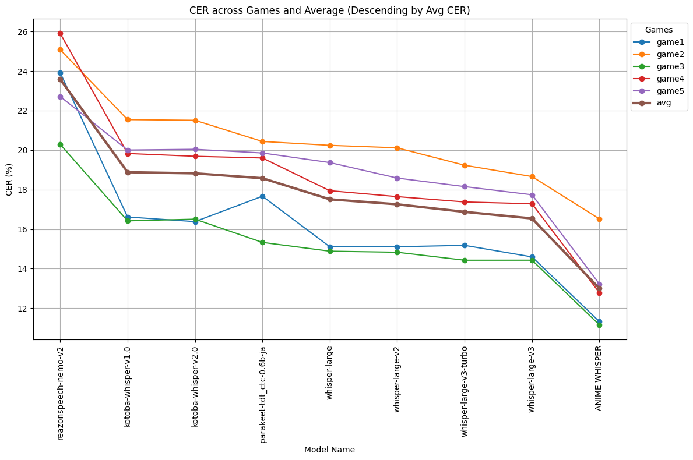
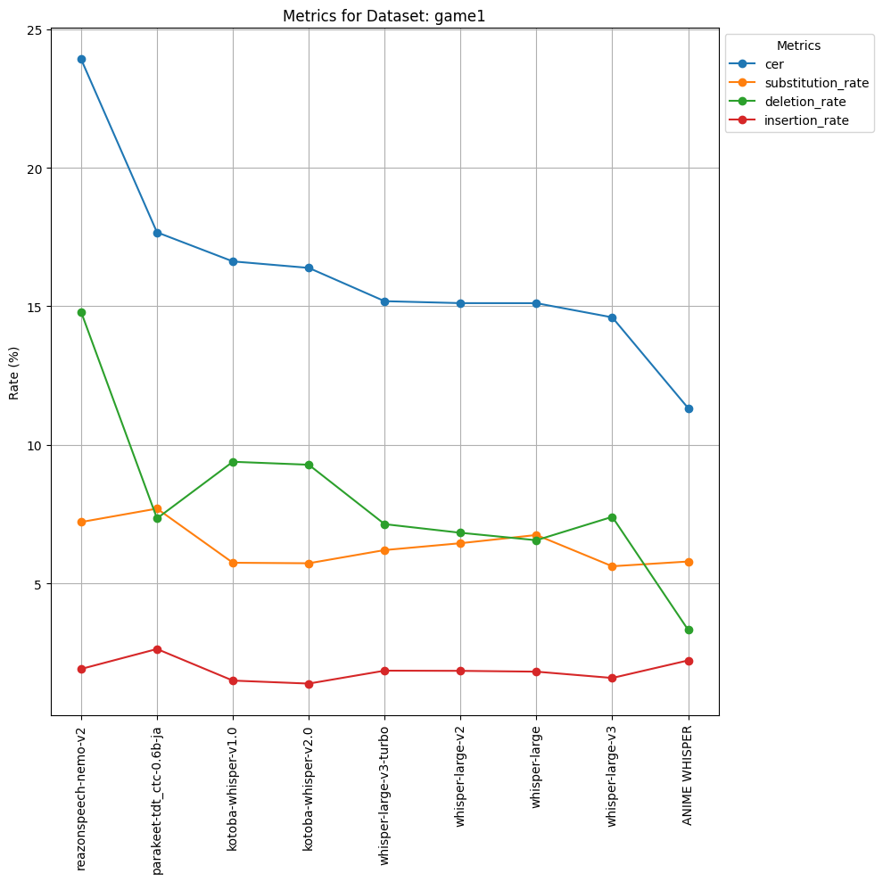
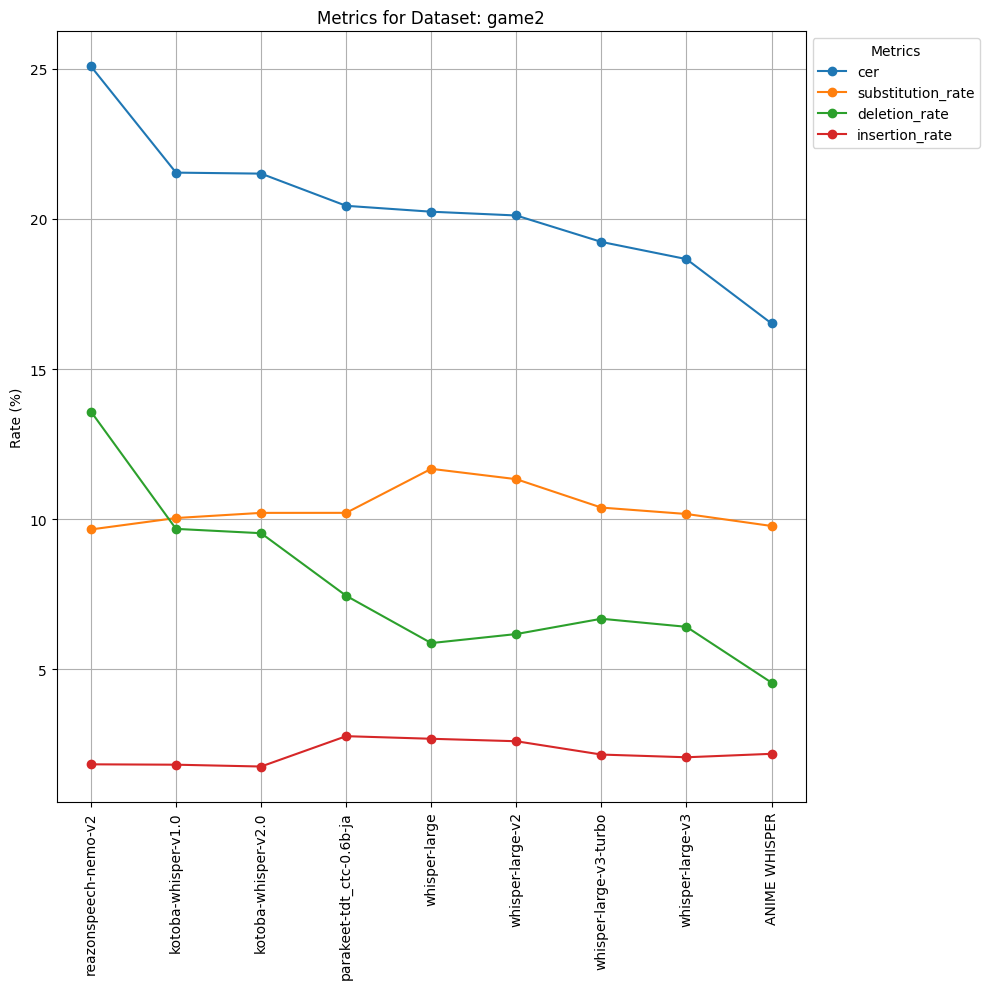
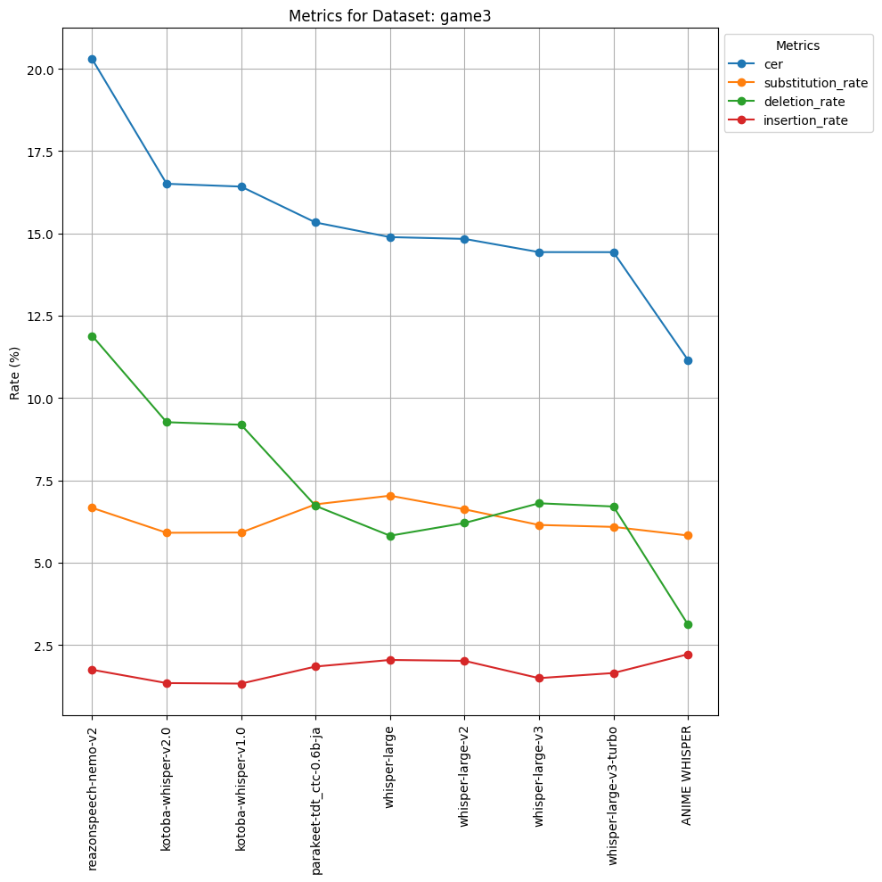
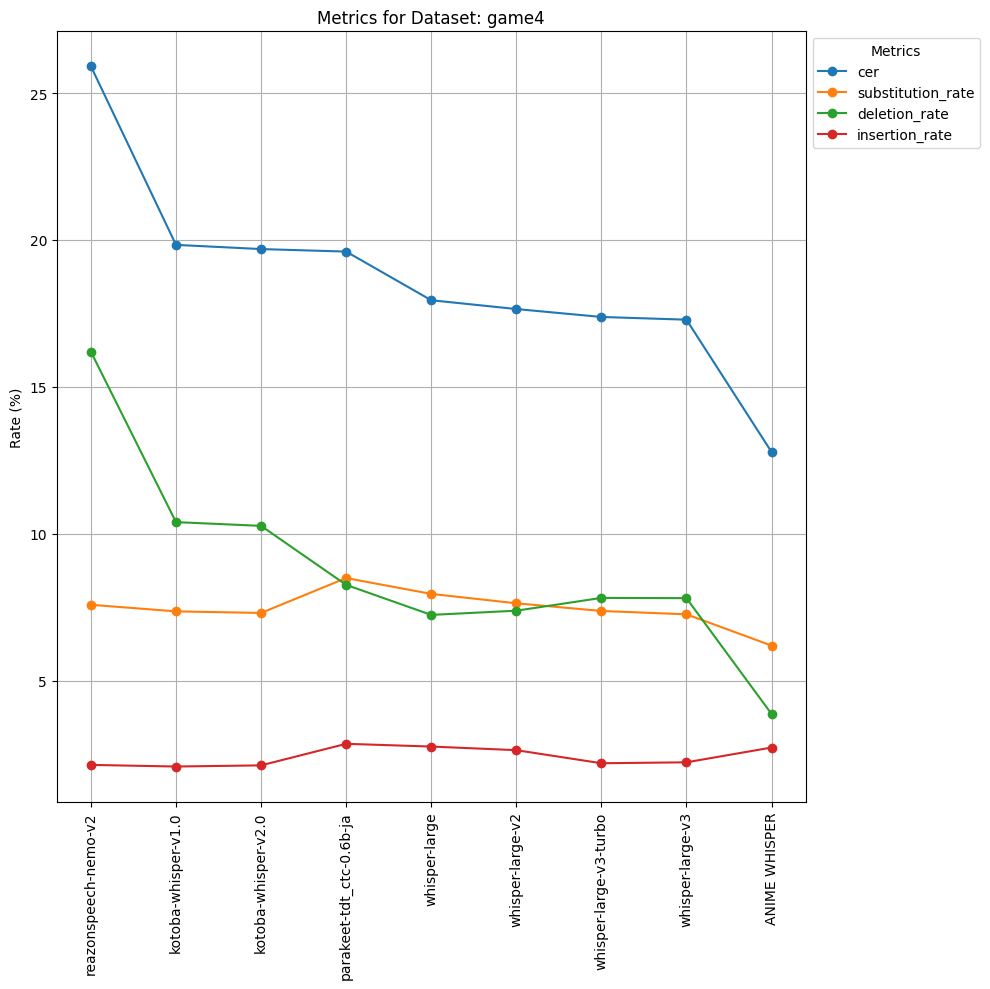
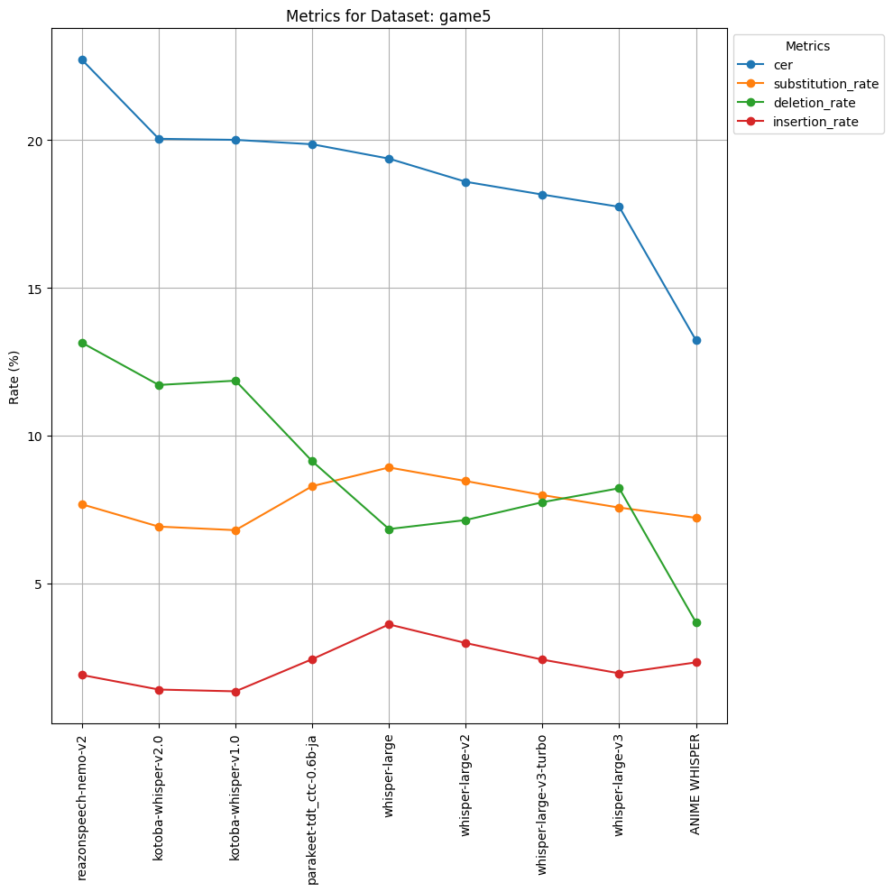

# 評価

**随時更新します**

## CER (Character Error Rate, 文字誤り率)

- 「学習データと同じアニメ調セリフのドメインではあるが、学習データには含まれていない、個人的に所持している5本ノベルゲーム（合計約75kファイル）」で評価
- OpenAIのWhisper系は繰り返しのハルシネーションがよく起こるので、それを抑止する`no_repeat_ngram_size=5`のパラメータで生成した
- CERは適切な正規化を行った結果に対するCER

表

| モデル名 | game1 | game2 | game3 | game4 | game5 | avg |
| --- | --- | --- | --- | --- | --- | --- |
| [openai/whisper-large](https://huggingface.co/openai/whisper-large) | 15.11 | 20.24 | 14.89 | 17.95 | 19.37 | 17.5 |
| [openai/whisper-large-v2](https://huggingface.co/openai/whisper-large-v2) | 15.11 | 20.12 | 14.83 | 17.65 | 18.59 | 17.3 |
| [openai/whisper-large-v3](https://huggingface.co/openai/whisper-large-v3) | 14.60 | 18.66 | 14.43 | 17.29 | 17.74 | 16.5 |
| [openai/whisper-large-v3-turbo](https://huggingface.co/openai/whisper-large-v3-turbo) | 15.18 | 19.24 | 14.43 | 17.38 | 18.15 | 16.9 |
| [reazon-research/reazonspeech-nemo-v2](https://huggingface.co/reazon-research/reazonspeech-nemo-v2) | 23.92 | 25.08 | 20.29 | 25.91 | 22.71 | 23.6 |
| [nvidia/parakeet-tdt_ctc-0.6b-ja](https://huggingface.co/nvidia/parakeet-tdt_ctc-0.6b-ja) | 17.67 | 20.44 | 15.33 | 19.60 | 19.86 | 18.6 |
| [kotoba-tech/kotoba-whisper-v1.0](https://huggingface.co/kotoba-tech/kotoba-whisper-v1.0) | 16.62 | 21.54 | 16.42 | 19.83 | 20.01 | 18.9 |
| [kotoba-tech/kotoba-whisper-v2.0](https://huggingface.co/kotoba-tech/kotoba-whisper-v2.0) | 16.38 | 21.51 | 16.51 | 19.69 | 20.04 | 18.8 |
| **Anime Whisper** | 11.32 | 16.52 | 11.16 | 12.78 | 13.23 | 13.0 |

## CER内部の詳しい評価

単なるCERの他に、

- `substitution_rate`: 置換誤り率
- `deletion_rate`: 削除誤り率
- `insertion_rate`: 挿入誤り率

を計算してモデルごとに比較したグラフを示す。

game1

game2

game3

game4

game5

# 他モデルについての観察

To be written.
